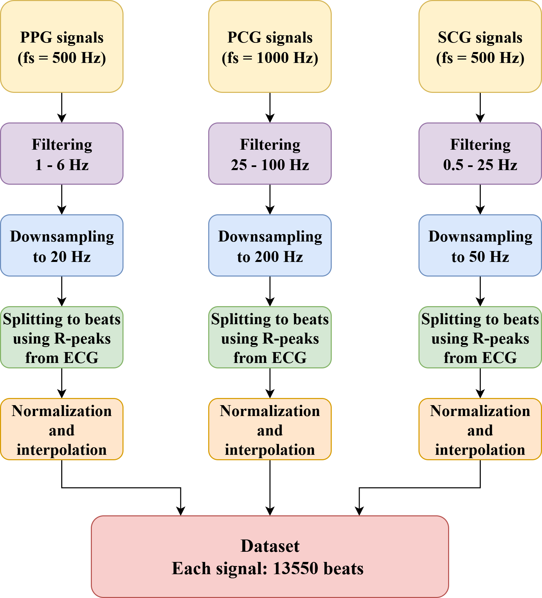

# Heart Failure Detection from synchronized PPG, PCG and SCG Signals using 1D CNNs

This project investigates the use of **mechanical cardiac signals** for **automatic heart failure detection**, aiming to provide a low-cost, non-invasive, and widely deployable diagnostic tool. By applying deep learning to raw PPG beats, we evaluate the effectiveness of convolutional neural networks (CNNs) for distinguishing heart failure patients from healthy subjects.

---

## Key Contributions
- Developed a **1D Convolutional Neural Network (CNN)** tailored for PPG signal classification.  
- Evaluated performance on **13,550 segmented PPG, PCG, and SCG beats**.  
- Compared different preprocessing strategies to optimize model robustness.  
- Demonstrated that non-invasively aquired signals can reliably support **cardiac diagnostics** when combined with deep learning.

---

## Dataset
- **PPG, PCG and SCG recordings** acquired from clinical subjects. 
- Dataset includes both **heart failure patients** and **control group**.
  

---

## Model Architecture
- **1D CNN** for temporal feature extraction.  
- Multiple convolutional layers followed by pooling and fully connected layers.  
- Training with **early stopping** to prevent overfitting.

---

## Results
- Achieved **0.89** in distinguishing heart failure patients from controls.  
- Results imply that **CNN models** can serve as a viable diagnostic aid.    
---

## Conclusion
- Cardiac signals are **simple and affordable biosignals**, they can be leveraged with deep learning for **heart failure detection**.  
- The proposed CNN model highlights the potential of combining **signal processing, machine learning, and healthcare applications**.  
- Future work: expand dataset, include electrical activity of heart (ECG signals), and evaluate in real clinical settings.

---

## Reference
This work was presented at **Photonica 2025**.

---

👉 Related repo: [GitHub Implementation](https://github.com/masatio/eeg_feature_extraction_using_deep_learning)
